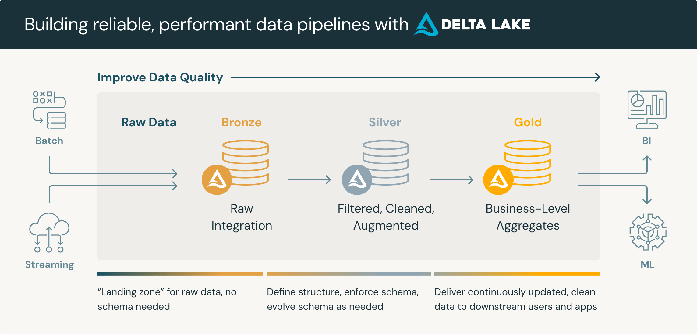
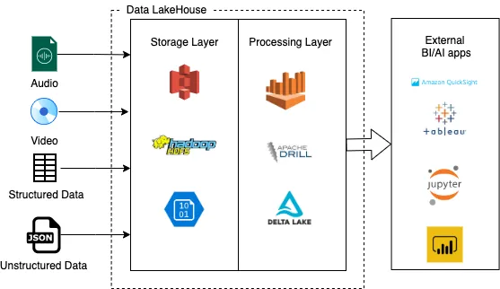

# Data Lakehouse 101

**Data Lakehouse local stack with PySpark, Trino, and Minio**

This repository aims to introduce the Data Lakehouse pattern as a suitable and flexible solution to transit small companies to established enterprises, allowing to implement a local Data Lakehouse from OpenSource solutions, compatible with Cloud production grade tools.

## Introduction

In the world of ML and AI, **data** is the crown jewel, but it's normally lost in [Swamps](https://www.superannotate.com/blog/data-lakes-vs-data-swamps-vs-data-warehouse) due to bad practices with **Data Lakes** when companies try to productionize their data.

**Data Warehouses** are costly solutions for this problem, and increase the complexity of simple Lakes.

Here's where **Data Lakehouses** come into action, being a hybrid solution with the best of both worlds. ([source](https://2024.pycon.co/en/talks/23)).

**Data Lakehouses** aim to combine elements of data warehousing with core elements of the data lake. Put simply, they are designed to provide the lower costs of cloud storage even for large amounts of raw data alongside support for certain analytics concepts – such as SQL access to curated and structured data tables stored in relational databases, or support for large scale processing of Big Data analytics or machine learning workloads ([source](https://www.exasol.com/resource/data-lake-warehouse-or-lakehouse/)).

<BR/>
([Image source](https://www.databricks.com/glossary/data-lakehouse))

## The Medallion Architecture

A medallion architecture is a data design pattern used to logically organize data in a lakehouse, with the goal of incrementally and progressively improving the structure and quality of data as it flows through each layer of the architecture (from Bronze ⇒ Silver ⇒ Gold layer tables). Medallion architectures are sometimes also referred to as "multi-hop" architectures.

<BR/>
([Image source](https://www.databricks.com/glossary/medallion-architecture))

* Bronze: ingestion tables (raw data, originals).

* Silver: refined/cleaned tables.

* Gold: feature/aggregated data store.

* Platinum (optional): in a faster format like a high-speed DBMS, because `gold` is stored in cloud bucket storage (like AWS S3(), and it's slow for e.g. real-time dashboard.

Readings:

* https://www.databricks.com/glossary/medallion-architecture
* https://learn.microsoft.com/en-us/azure/databricks/lakehouse/medallion
* https://medium.com/@junshan0/medallion-architecture-what-why-and-how-ce07421ef06f


## Data Lakehouse Components

<BR/>
([Image source](https://medium.com/adfolks/data-lakehouse-paradigm-of-decade-caa286f5b7a1))

* **Apache Spark**<BR/>
  Processing Layer.<BR/>
  [https://spark.apache.org](https://spark.apache.org)<BR/>
  [https://spark.apache.org/docs/latest/api/python/index.html](https://spark.apache.org/docs/latest/api/python/index.html)<BR/>

* **Minio**<BR/>
  Landing buckets and data storage layer.<BR/>
  [https://min.io](https://min.io)

* **Apache Hive**<BR/>
  Data catalog.<BR/>
  [https://hive.apache.org](https://hive.apache.org)

* **Postgres Database**<BR/>
  Data catalog persistence.<BR/>
  [https://www.postgresql.org](https://www.postgresql.org)

* **Delta Lake** (open table format)<BR/>
  [https://delta.io](https://delta.io)<BR/>
  Open source framework developed by Databricks. Like other modern table formats, it employs file-level listings, improving the speed of queries considerably compared to the  directory-level listing of Hive. Offers enhanced CRUD operations, including the ability to update and delete records in a data lake which would previously have been immutable.<BR/>
  (Click [here](https://www.starburst.io/data-glossary/open-table-formats/) for more information about Open Table Formats).<BR/>

* **Trino**<BR/>
  Query engine and data governance.<BR/>
  [https://trino.io](https://trino.io)

## Other Components

* **SQL Alchemy**<BR/>
  [https://docs.sqlalchemy.org](https://docs.sqlalchemy.org)

* **Pandas**<BR/>
  [https://pandas.pydata.org](https://pandas.pydata.org)

* **Jupiter Lab**<BR/>
  [https://docs.jupyter.org](https://docs.jupyter.org)

## Requirements

* [Git](https://www.atlassian.com/git/tutorials/install-git)
* Make: [Mac](https://formulae.brew.sh/formula/make) | [Windows](https://stackoverflow.com/questions/32127524/how-to-install-and-use-make-in-windows)
* [Docker and Docker Composer](https://www.docker.com/products/docker-desktop)
* [wget](https://www.jcchouinard.com/wget-install/)

## Usage

Clone the respository:

```bash
git clone https://github.com/tomkat-cr/lakehouses-101-pycon2024.git
cd lakehouses-101-pycon2024
```

Download the required packages:

```bash
make install
```

**IMPORTANT**: this process will take a long time, depending on your Internet connection speed.

Start the local stack:

```bash
make run
```

Run the local Jupiter engine:

```bash
make open_local_jupiter
```

Run the local Minio explorer:

```bash
make open_local_minio
```

## Data preparation

Decompress the example data files for the Pockemon Data Ingestion:

```bash
cd data
unzip moves.zip
unzip pokemon.zip
unzip types.zip
```

### Jupiter notebooks

* [Pokemon data ingestion](notebooks/Pokemon-data-ingestion.ipynb)

## License

This is a open-sourced software licensed under the [MIT](LICENSE) license.

## Credits

This project is maintained by [Alejandro Gómez Montoya](https://github.com/alejogm0520). For more information or to contribute to the project, visit [Data Lakehouse 101 on GitHub](https://github.com/alejogm0520/lakehouses-101-pycon2024).

Happy Coding!
